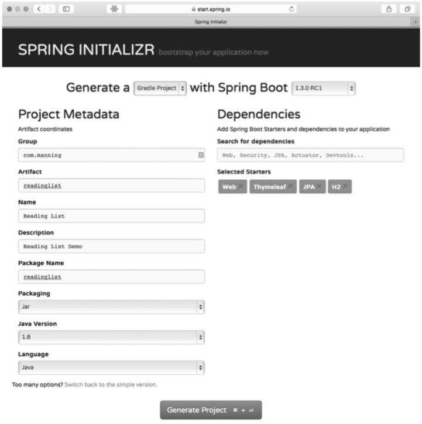

# Developing your first Spring Boot application
# 开发你的第一个Spring Boot应用程序

This chapter covers

* Working with Spring Boot starters
* Automatic Spring configuration

When’s the last time you went to a supermarket or major retail store and actually had to push the door open? Most large stores have automatic doors that sense your presence and open for you. Any door will enable you to enter a building, but automatic doors don’t require that you push or pull them open.

Similarly, many public facilities have restrooms with automatic water faucets and towel dispensers. Although not quite as prevalent as automatic supermarket doors, these devices don’t ask much of you and instead are happy to dispense water and towels.

And I honestly don’t remember the last time I even saw an ice tray, much less filled it with water or cracked it to get ice for a glass of water. My refrigerator/freezer somehow magically always has ice for me and is at the ready to fill a glass for me.

I bet you can think of countless ways that modern life is automated with devices that work for you, not the other way around. With all of this automation everywhere, you’d think that we’d see more of it in our development tasks. Strangely, that hasn’t been so.

Up until recently, creating an application with Spring required you to do a lot of work for the framework. Sure, Spring has long had fantastic features for developing amazing applications. But it was up to you to add all of the library dependencies to the project’s build specification. And it was your job to write configuration to tell Spring what to do.

In this chapter, we’re going to look at two ways that Spring Boot has added a level of automation to Spring development: starter dependencies and automatic configuration. You’ll see how these essential Spring Boot features free you from the tedium and distraction of enabling Spring in your projects and let you focus on actually developing your applications. Along the way, you’ll write a small but complete Spring application that puts Spring Boot to work for you.

## 2.1 Putting Spring Boot to work

The fact that you’re reading this tells me that you are a reader. Maybe you’re quite the bookworm, reading everything you can. Or maybe you only read on an as-needed basis, perhaps picking up this book only because you need to know how to develop applications with Spring.

Whatever the case may be, you’re a reader. And readers tend to maintain a reading list of books that they want (or need) to read. Even if it’s not a physical list, you probably have a mental list of things you’d like to read.1

Throughout this book, we’re going to build a simple reading-list application. With it, users can enter information about books they want to read, view the list, and remove books once they’ve been read. We’ll use Spring Boot to help us develop it quickly and with as little ceremony as possible.

To start, we’ll need to initialize the project. In chapter 1, we looked at a handful of ways to use the Spring Initializr to kickstart Spring Boot development. Any of those choices will work fine here, so pick the one that suits you best and get ready to put Spring Boot to work.

From a technical standpoint, we’re going to use Spring MVC to handle web requests, Thymeleaf to define web views, and Spring Data JPA to persist the reading selections to a database. For now, that database will be an embedded H2 database. Although Groovy is an option, we’ll write the application code in Java for now. And we’ll use Gradle as our build tool of choice.

If you’re using the Initializr, either via its web application or through Spring Tool Suite or IntelliJ IDEA, you’ll want to be sure to select the check boxes for Web, Thymeleaf, and JPA. And also remember to check the H2 check box so that you’ll have an embedded database to use while developing the application.

As for the project metadata, you’re welcome to choose whatever you like. For the purposes of the reading list example, however, I created the project with the information shown in figure 2.1.

[1]: # "If you’re not a reader, feel free to apply this to movies to watch, restaurants to try, or whatever suits you."



__Figure 2.1 Initializing the reading list app via Initializr’s web interface__

If you’re using Spring Tool Suite or IntelliJ IDEA to create the project, adapt the details in figure 2.1 for your IDE of choice.

On the other hand, if you’re using the Spring Boot CLI to initialize the application, you can enter the following at the command line:

```
$ spring init -dweb,data-jpa,h2,thymeleaf --build gradle readinglist
```

Remember that the CLI’s init command doesn’t let you specify the project’s root package or the project name. The package name will default to “demo” and the project name will default to “Demo”. After the project has been created, you’ll probably want to open it up and rename the “demo” package to “readinglist” and rename “DemoApplication .java” to “ReadingListApplication.java”.


__Figure 2.2 The structure of the initialized readinglist project__

Once the project has been created, you should have a project structure similar to that shown in figure 2.2.

This is essentially the same project structure as what the Initializr gave you in chapter 1. But now that you’re going to actually develop an application, let’s slow down and take a closer look at what’s contained in the initial project.
